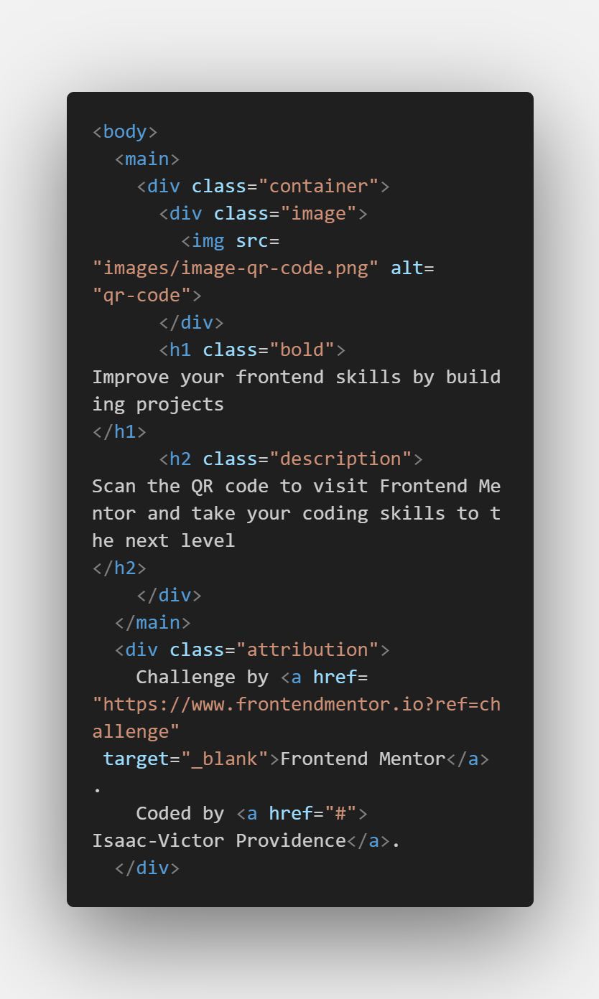
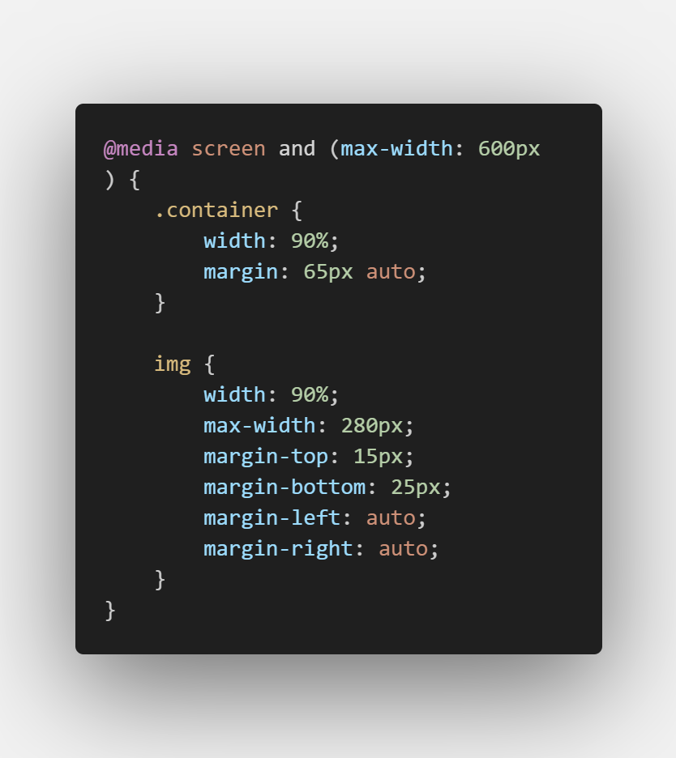
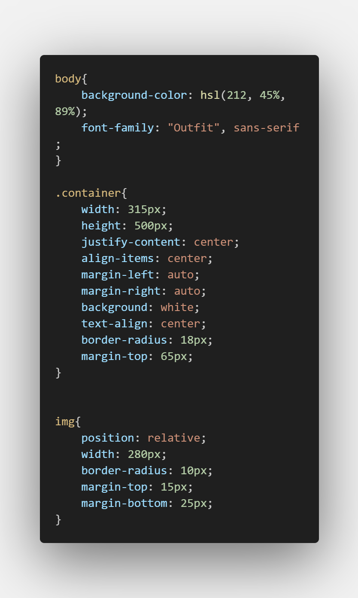

# QR code component solution

This is a solution to the [QR code component challenge on Frontend Mentor](https://www.frontendmentor.io/challenges/qr-code-component-iux_sIO_H). Frontend Mentor challenges help you improve your coding skills by building realistic projects. 

## Table of contents

- [Overview](#overview)
  - [Screenshot](#screenshot)
  - [Links](#links)
- [My process](#my-process)
  - [Built with](#built-with)
  - [What I learned](#what-i-learned)
  - [Continued development](#continued-development)
  - [Useful resources](#useful-resources)
- [Author](#author)

## Overview

### Screenshot

- This project demonstrates the creation of a responsive QR code component using HTML and CSS. It provides a visually appealing way to encourage users to visit a specific website or URL by scanning the QR code.





### Links

- Solution URL: [Add solution URL here](https://your-solution-url.com)
- Live Site URL: [Add live site URL here](https://your-live-site-url.com)

## My process

### Built with

- Semantic HTML5 markup
- CSS custom properties
- CSS Responsiveness
- Local Images


### What I learned

- Learnt Responsiveness

```css
@media screen and (max-width: 600px) {
    .container {
        width: 90%;
        margin: 65px auto;
    }
    
    img {
        width: 90%;
        max-width: 280px;
        margin-top: 15px;
        margin-bottom: 25px;
        margin-left: auto; 
        margin-right: auto;
    }
}

```

### Continued development

- Responsiveness in CSS
- CSS Positioning


## Author

- Frontend Mentor - [Isaac-Victor Providence](https://www.frontendmentor.io/profile/Emoji123-s)
- Twitter - [Divine Providence](https://twitter.com/p_r_o_v_i_dence)
- Github - [Isaac-Victor Providence](https://github.com/Emoji123-s)